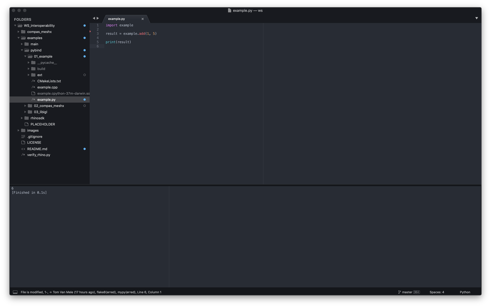

# COMPAS Workshop: Interoperability

Start | Topic
---   | ---
09:00 | **Technical assistance** (BRG corner)
11:00 | COMPAS framework
11:30 | Setup
12:00 | COMPAS Main
12:30 | COMPAS Packages
13:00 | **Lunch & Discussion**
14:00 | C/C++ & PyBind
15:00 | **Break**
15:30 | MeshPattern example
16:30 | **Break**
17:00 | C/C++ & Rhino SDK


Throughout the workshop, to execute "command line" instructions, please use
"Anaconda Prompt" (**NOT** "Command Prompt") on Windows or "Terminal" on Mac.
Make sure to launch Anaconda Prompt *as administrator*.


## Preparations

**1. Install required tools**

*   [Anaconda 3](https://www.anaconda.com/distribution/)
*   [Blender 2.8](https://www.blender.org/2-8/)
*   [CMake >= 3.12](https://cmake.org/download/)
*   [VS Code](https://code.visualstudio.com/) or [Sublime Text 3](https://www.sublimetext.com/3) 

If you still have an old installation of Anaconda (for example version 2), please remove it.
Install Anaconda 3 in a sensible location, and don't register it on the PATH (Windows). 
The recommended location for installing Anaconda is in your home directory

* Mac: `~/anaconda3`
* Windows: `%USERPROFILE%\Anaconda3`

Blender 2.8 is still a beta release, but it is the future of Blender.
The `compas_blender` package in the latest version of COMPAS no longer supports
older versions.

We highly recommend VS Code or Sublime Text 3 for your Python/COMPAS coding, since these
tools provide proper support for `conda` and virtual environments.
Please follow the installation instructions in the COMPAS docs:

*   [VS Code](https://compas-dev.github.io/main/environments/vscode.html)
*   [Sublime Text 3](https://compas-dev.github.io/main/environments/sublimetext.html)

If you are using Rhino 5 on Windows,
make sure to upgrade IronPython to `2.7.5`,
and install GHPython if you want to use GrassHopper.

**2. Install optional requirements**

*   [Microsoft Visual C++ 14.0](https://www.scivision.dev/python-windows-visual-c-14-required/)

Two of the examples of COMPAS main (`06_triangle_blender` and `07_rpc_rhino`) use `triangle` in the background.
To install `triangle` on Windows, you will need Microsoft Visual C++ 14.0.
Many people already have this installed without even knowing it,
but if you don't, please follow the instructions at the link above.

*   [Rhino: Dev Tools (Windows)](https://developer.rhino3d.com/guides/cpp/installing-tools-windows/)
*   [Rhino: Dev Tools (Mac)](https://developer.rhino3d.com/guides/rhinocommon/installing-tools-mac/)

**3. Clone the workshop repo**

Set up a root folder for today's workshop, and clone the workshop repo into this
folder. For example:

*Mac*

```bash
mkdir ~/Code/Workshops
cd ~/Code/Workshops
git clone --recursive https://github.com/BlockResearchGroup/WS_interoperability.git
cd WS_interoperability
```

*Windows*

```bash
mkdir %USERPROFILE%\Code\Workshops
cd %USERPROFILE%\Code\Workshops
git clone --recursive https://github.com/BlockResearchGroup/WS_interoperability.git
cd WS_interoperability
```

> **Note**
>
> To simplify access to the workshop files, simply add the (parent) folder to
> the active workspace in VS Code or ST3.

**3. Clean up PYTHONPATHs**

If you have (an old version of) the COMPAS framework installed on your system through
the modification of `PYTHONPATH`, you should clean that up.

*   Remove COMPAS from the `PYTHONPATH` environment variable
*   Remove COMPAS from the "Modules Search Paths" in Rhino (Windows)
*   Remove COMPAS from "RhinoSettings" in Atom


## Getting Started

**1. Install COMPAS**

The recommended way to install COMPAS is using `conda`, which is the package and
environment manager of Anaconda.
For this workshop, we will install COMPAS 0.5.2 in a virtual environment named
"interop" running on Python 3.7.

On the command line, do

```bash
conda config --add channels conda-forge
conda create -n interop python=3.7
conda activate interop
conda install COMPAS=0.5.2
```

On Mac, also run the following

```bash
conda install python.app
```

To check the installation, print the version of COMPAS in the interactive Python interpreter

```python
>>> import compas
>>> compas.__version__
'0.5.2'
>>> exit()
```

> **Note**
>
> Whenever the command line is to be used during the workshop,
> make sure that the "interop" environment is active.
> The active environment is listed in parentheses before the prompt.
>
> * Windows: `(interop) >`
> * Mac: `(interop) $`
>

**2. Install COMPAS for Rhino**

Rhino uses IronPython to interpret Python scripts, and it ships with its own version
of IronPython to do so. COMPAS is written primarily in pure Python and its CPython
specific dependencies are wrapped in `try-except` statements, such that the various
installed COMPAS packages of a specific virtual environment can also be "installed"
as a "site package" for Rhino.

On the command line, simply do

*Mac*

```bash
python -m compas_rhino.uninstall
python -m compas_rhino.install
```

*Windows Rhino 5*

```bash
python -m compas_rhino.uninstall -v 5.0
python -m compas_rhino.install -v 5.0
```

*Windows Rhino 6*

```bash
python -m compas_rhino.uninstall -v 6.0
python -m compas_rhino.install -v 6.0
```


To check the installation, launch Rhino and run the verification script that
can be found at the root of the workshop repo: `verify_rhino.py`
To run a script in Rhino, just type `RunPythonScript` at the Rhino command prompt
and select the verification scriopt from the repo.
The script should print out the version of COMPAS (`'0.5.2'`) in the console window.

**3. Install COMPAS for Blender 2.8**

Blender ships with its own version of CPython, which it uses to interpret BlenderPython scripts.
To install COMPAS for Blender, you can simply replace the shipped Python with one of the Pythons
installed on your system; for example, the python of one of your virtual environments.

It is important that the replacement version matches the version of Python that was shipped with Blender.
Blender 2.8 ships with Python 3.7, which is the version we (coincidentally) installed in our environment.

The procedure for replacing the shipped Python is simple.
With the "interop" environment active, on the command line do:

*Mac*

```bash
cd /Applications/blender.app/Contents/Resources/2.80
mv python original_python
ln -s $CONDA_PREFIX python
```

*Windows*

```bash
cd %PROGRAMFILES%\Blender Foundation\Blender\2.80
ren python original_python
mklink /j python %CONDA_PREFIX%
```


To check the installation, launch Blender, switch to the "Scripting" view and type the following in the
interactive Python console:

```python
>>> import compas
>>> compas.__version__
'0.5.2'
```


## COMPAS main

The examples below can be found in the folder `examples/01_main`.
The files are easily accessible if you add the workshop repo (parent) folder to 
the active workspace in VS Code or ST3.

*   **01_shortestpath_plot**:
    Shortest path between two nodes of a network visualised with a `NetworkPlotter`.

    *   Run `01_shortestpath_plot.py` in your editor.

    

*   **02_dynamicrelaxation_live**:
    Visualisation of the dynamic relaxation process of a mesh with a `MeshPlotter`.

    *   Run `02_dynamicrelaxation_live.py` in your editor.

    

*   **03_smoothingonsurface_rhino**:
    Smooth a mesh on a NURBS surface in Rhino and visualize the process with a `MeshConduit`.

    *   Open `03_smoothingonsurface_rhino.3dm` in Rhino.
    *   Run `03_smoothingonsurface_rhino.py` in the Rhino PythonScriptEditor.

    

    > **Note**
    >
    > On Windows, you can visualize the smoothing process using a `Conduit`.
    > See `03b_smoothingonsurface_rhino.py` for an example.

*   **04_interactivesubd_rhino**:
    Generate a subdivision surface by interactively modifying a control mesh.

    *   Run `04_interactivesubd_rhino.py` in Rhino.

    

*   **05_numba_blender**:
    Use `numba` for JIT compilation directly from Blender because it supports CPython.

    ```
    Under construction...
    ```

*   **06_triangle_blender**:
    Use extension packages like `triangle` directly from Blender.

    For this example, you will have to install `triangle`.
    On Mac, just ```pip install triangle``` should to the trick.
    On Windows, you may need to install [Microsoft Visual C++ 14.0](https://www.scivision.co/python-windows-visual-c++-14-required/) first
    as described above.
    
    > **Note**
    >
    > Make sure to have the `interop` environment active when you do ```pip install triangle```!

    *   Run `06_triangle_blender.py` in the Blender ScriptEditor.

    

*   **07_rpc_rhino**:
    Use extension packages like `triangle` from Rhino through a Remote Procedure Call.

    For this example, you will have to install `triangle`.
    On Mac, just ```pip install triangle``` should to the trick.
    On Windows, you may need to install [Microsoft Visual C++ 14.0](https://www.scivision.co/python-windows-visual-c++-14-required/) first
    as described above.
    
    > **Note**
    >
    > Make sure to have the `interop` environment active when you do ```pip install triangle```!

    *   Run `07_triangle_rhino.py` in the Rhino PythonScriptEditor.

        

*   **08_fofinplugin_rhino**:
    Use a CommandPlugin for interactive form finding in Rhino.

    *   Install `FoFin` plugin.
    *   Steps:
        *   `FoFin_init`
        *   `FoFin_from-json`
        *   `FoFin_select-continuous-edges`
        *   `FoFin_update-edge-attributes`
        *   `FoFin_compute-equilibrium`
        *   `FoFin_update-settings`

    ```
    Under construction...
    ```


## COMPAS packages

To illustrate the development and use of COMPAS packages, we will make a package
called `compas_meshx`, create an editable install on our system, and build the docs.

**0. Navigate to the parent of the workshop repo**

*   Navigate to the parent folder of the workshop repo:

    *Mac*

    ```bash
    cd ~/Code/Workshops/
    ```
    
    *Windows*

    ```bash
    cd %USERPROFILE%\Code\Workshops\
    ```

**1. Make the package**

*   Install `cookiecutter`

    *   ```pip install cookiecutter```
    
        Don't forget to have the `interop` environment active when you do this.

*   Run `cookiecutter`:

    *   ```cookiecutter gh:BlockResearchGroup/cookeicutter-compas-package```
    *   Follow the instructions:

        *   ```project name [Name of the project]:``` **COMPAS X**
        *   ```project slug [compas_x]:```
        *   ```project_short_description [A short description of the project]:``` **Extension modules for the COMPAS framework.**
        *   ```version [0.1.0]: ```
        *   ```COMPAS_version [0.5.1]:``` **0.5.2**
        *   ```release_date [2019-04-14]:```
        *   ```copyright [Block Research Group - ETH Zurich]:``` **NCCR - ETH Zurich**
        *   ```author_name [Your name]:``` **Tom Van Mele**
        *   ```author_email [Your email]:``` **vanmelet@ethz.ch**
        *   ```github_username [Your personal Github username]:``` **brgcode**
        *   ```github_organization [BlockResearchGroup]:```

**2. Install the package**

*   Change into the package root folder

    *   ```cd compas_x```

*   Install the package and the necessary developer tools

    *   ```pip install -r requirements-dev.txt```
    *   *Mac*: ```python -m compas_rhino.install -p compas_x```
    *   *Windows Rhino 5*: ```python -m compas_rhino.install -v 5.0 -p compas_x```
    *   *Windows Rhino 6*: ```python -m compas_rhino.install -v 6.0 -p compas_x```

**3. Build and open the docs**

*   ```invoke docs```
*   *Mac*: ```open docs/index.html```
*   *Windows*: ```start firefox ./docs/index.html```


## C/C++ & PyBind

Use [PyBind11](https://pybind11.readthedocs.io/en/master/index.html)
to create Python bindings of existing C++ code.
The examples below can be found in the folder `examples/02_pybind`.

*   **01_basic**:
    Basic example from the [PyBind11 docs](https://pybind11.readthedocs.io/en/stable/basics.html)
    with [CMake as build system](https://pybind11.readthedocs.io/en/stable/compiling.html#building-with-cmake).

    *   Navigate to root of `01_basic`

        *Mac*

        ```bash
        cd ~/Code/Workshops/WS_interoperability/examples/pybind/01_basic
        ```

        *Windows*

        ```bash
        cd %USERPROFILE%\Code\Workshops\WS_interoperability\examples\pybind\01_basic
        ```

    *   `example.cpp`

        ```cpp
        #include <pybind11/pybind11.h>

        int add(int i, int j) {
            return i + j;
        }

        PYBIND11_MODULE(example, m) {
            m.doc() = "pybind11 example plugin";

            m.def("add", &add, "A function which adds two numbers");
        }
        ```

    *   `CMakeLists.txt`

        ```bash
        cmake_minimum_required(VERSION 3.12)
        set(CMAKE_CXX_STANDARD 11)

        project(fromthedocs)

        # Pybind11
        set(PYBIND11_CPP_STANDARD -std=c++11)
        set(PYBIND11_PYTHON_VERSION 3.7)
        set(PYTHON_EXECUTABLE "$ENV{CONDA_PREFIX}/bin/python3.7")
        add_subdirectory(${CMAKE_SOURCE_DIR}/ext/pybind11)

        # the example module
        pybind11_add_module(example MODULE example.cpp)

        set_target_properties(example PROPERTIES LIBRARY_OUTPUT_DIRECTORY "${CMAKE_SOURCE_DIR}")
        ```

    *   Compilation instructions

        ```bash
        mkdir build
        cd build
        cmake -DCMAKE_BUILD_TYPE=Release ..
        make -j 4
        ```

    *   Run `example.py` in your editor

        

*   **02_libigl**:
    Use external libraries (libigl, shapeop?).

    

    

*   **03_compas**:
    Integrate into COMPAS as package

    

## MeshPattern

The code for this example can be found in `examples/03_advanced`. 

*   [Slides](MeshPattern.pdf)
*   [Docs](https://epfl-lgg.github.io/MeshPattern/)
*   [Repo](https://github.com/EPFL-LGG/MeshPattern)


## C/C++ & Rhino SDK

Use the Rhino SDK to create Rhino compatible bindings for a C/C++ library.
The examples below can be found in the folder `examples/04_rhinosdk`.

*   [Wrapping Native Libraries](https://developer.rhino3d.com/guides/rhinocommon/wrapping-native-libraries/)
*   [Cross-Platform Plugins](https://developer.rhino3d.com/guides/rhinocommon/your-first-plugin-crossplatform/)

```
Under construction...
```
